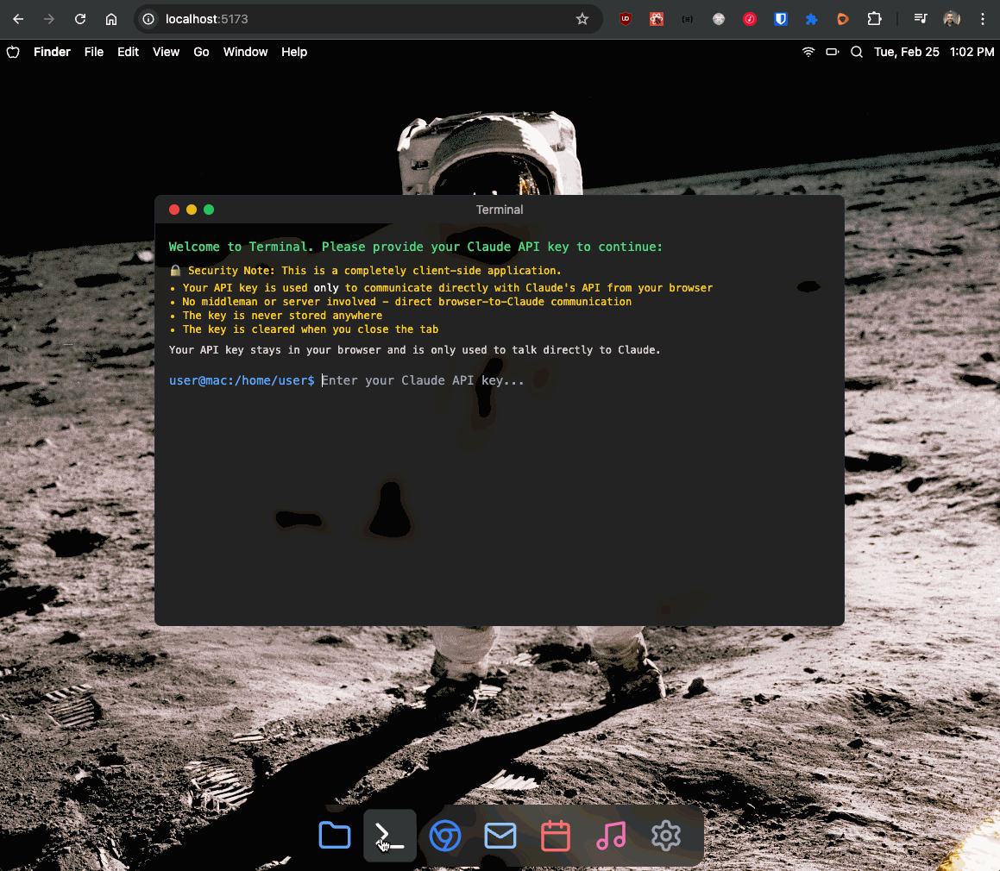

# terminaLLM - macOS Terminal Simulator

A browser-based simulation of a macOS terminal powered by Claude AI. This project creates a virtual terminal environment where all commands, filesystem operations, and state changes are simulated by Claude's language model.



## Overview

terminaLLM creates a realistic macOS terminal experience directly in your browser. Unlike traditional terminal emulators that connect to a real operating system, terminaLLM uses Claude AI to:

- Process and respond to standard Unix commands
- Maintain a virtual filesystem entirely in the AI's context
- Track command history and directory changes
- Simulate file operations like creating, editing, and deleting files
- Provide realistic error messages and command output

## Setup

1. Clone this repository
   ```
   git clone https://github.com/norbinsh/terminaLLM.git
   cd terminaLLM
   ```

2. Install dependencies
   ```
   npm install
   ```

3. Start the development server
   ```
   npm run dev
   ```

4. Open the application in your browser (usually at http://localhost:5173)

5. Enter your Anthropic API key when prompted
   - You'll need a valid API key from [Anthropic](https://www.anthropic.com/)
   - The key is only stored in browser memory and is never sent to any server except Anthropic's API

## Using the Terminal

Once you've entered your API key, you can use the terminal just like a real macOS terminal:

- Navigate with `cd`, `ls`, `pwd`
- Create files and directories with `touch`, `mkdir`
- Edit files with `nano`, `vim`, `cat >`, etc.
- Run common Unix utilities like `grep`, `find`, `ps`
- Use pipes and redirections: `ls | grep .txt`, `echo hello > file.txt`

The terminal maintains state between commands, so you can create a file and then reference it in later commands.

## How It Works

terminaLLM uses the Anthropic API directly from the browser with special headers that allow browser access. The application:

1. Sends commands to Claude AI with your current terminal state (directory, command history)
2. Processes the AI's response to extract the command output and any state changes
3. Updates the terminal display and internal state accordingly

All filesystem operations and command processing happen entirely within Claude's context window. The AI maintains a mental model of your virtual filesystem and updates it as you run commands.

## Technical Details

- Built with React, TypeScript, and Tailwind CSS
- Uses Zustand for state management
- Communicates directly with the Anthropic API from the browser
- Styled to look like a native macOS terminal

## Security Note

This application uses your Anthropic API key directly in the browser. While this works for development and personal use, be aware that:

1. Your API key is stored in browser memory
2. API usage will count against your personal quota
3. For a production application, consider implementing a backend service

## Contributing

Contributions are welcome! Please feel free to submit a Pull Request.

## License

MIT 